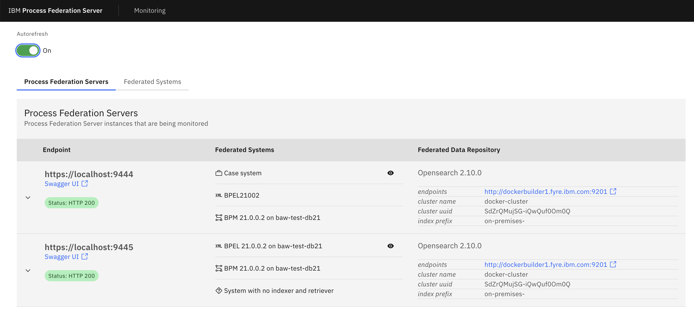
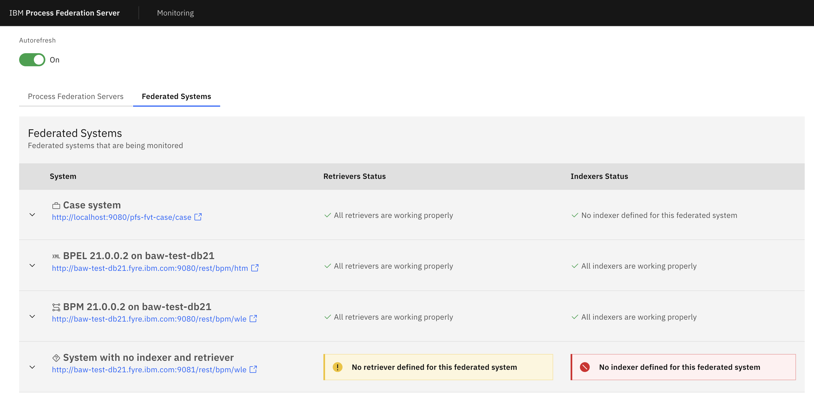
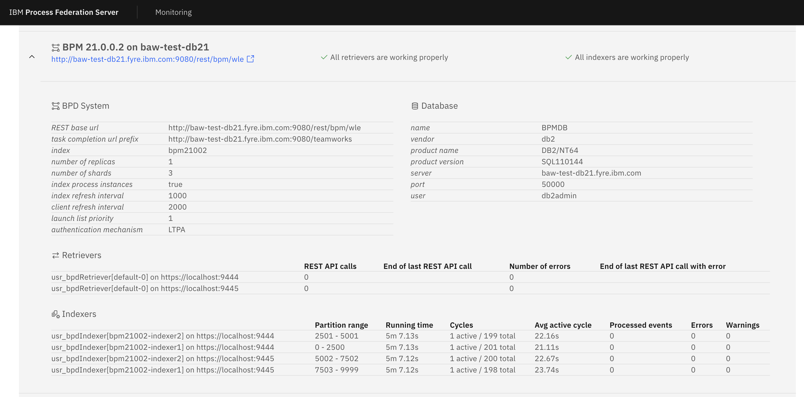
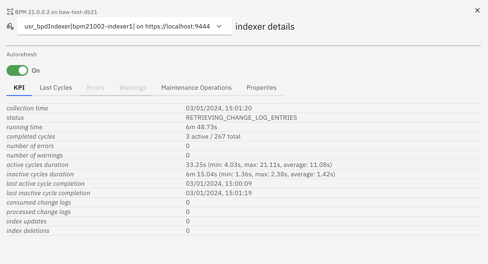
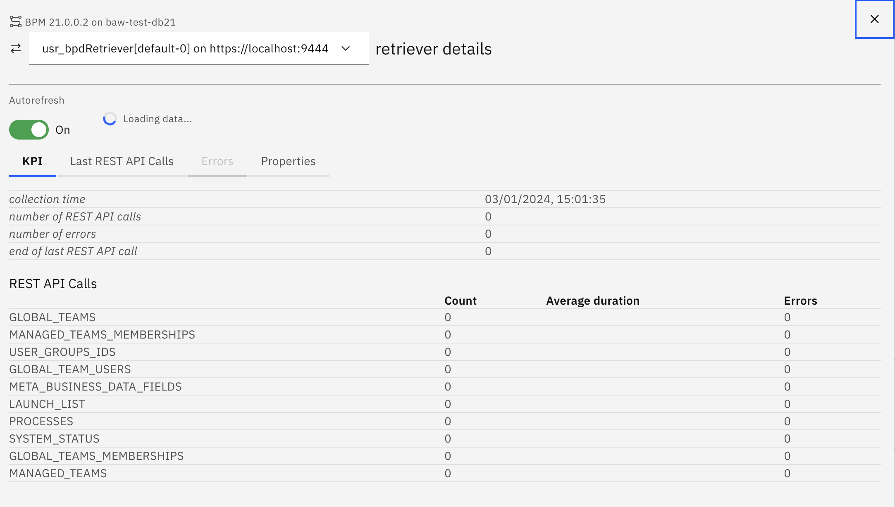

# IBM Process Federation Server Console

The Process Federation Server Console is a [Carbon React](https://carbondesignsystem.com/developing/frameworks/react/) web application that demonstrates how to leverage the Process Federation Server's [Cluster Runtimedata REST API](https://www.ibm.com/docs/en/baw/23.x?topic=mapfs-monitoring-process-federation-server-instances-using-runtimedata-rest-api) to monitor a list of Process Federation Server instances and their Federated Systems.

#### Table of content:

- [Capabilities](#capabilities)
- [Pre requisites](#pre-requisites)
- [How to start the IBM Process Federation Server Console](#how-to-start-the-ibm-process-federation-server-console)
- [How to connect to the IBM Process Federation Server Console](#how-to-connect-to-the-ibm-process-federation-server-console)
- [License Information](#license-information)

## Capabilities

Here are a few screenshots that illustrates the capabilities of the Process Federation Server Console:

#### Overview of Process Federation Server instances



This view displays a table with an entry for each one of the Process Federation Server instances that are configured for monitoring.

This table has three columns, and one row per Process Federation Server instance that is monitored. The three columns display the following information for a Process Federation Server instance:

- **Endpoint:** displays the endpoint (base URL) of the Process Federated Server instance, a link to the Swagger UI for this instance and the HTTP status returned by the runtimedata API of this instance. If the HTTP status is an error status, clicking the chevron on the left of the Endpoint column will reveal more information about the error.

- **Federated Systems:** displays a list of the federated systems that are configured in the Process Federation Server instance's server.xml configuration file. The displayName property of the federated system is used if it is defined in the server.xml configuration file, or else it is replaced with the value of the id property is. The display name or id of each federated system is preceded by an icon that depends on the type of the system.

  If there are issues or warnings reported for this system in the Process Federation server instance, the server name is higlighted by a red error box or a yellow warning box. Clicking a server name in the list will reveal more information about the server.

- **Federated Data Repository:** displays information about the federated data repository that this Process Federation Server instance is configured to use. If there are issues with the configured federated data repository, those are directly reported in this column.

When a federated system is clicked in the Federated Systems column, the following details are revealed:

- The configuration properties of the federated system in the Process Federation Server instance's server.xml configuration file, augmented with runtime information retrieved from the system if available (system version, etc...);

- Information about the database (datasource) configured for this federated system in the Process Federation Server instance's server.xml configuration file, augmented with runtime information retrieved from the database if available (database version, etc...);

- The retriever configured for this federated system in the Process Federation Server instance's server.xml configuration file, if any, along with some basic KPIs about this retriever. Clicking the retriever will display a popup window with more information about this retriever:

  - Key performance indicators for this retriever;
  - Details about the at most 10 last REST API calls performed by this retriever;
  - The at most 10 last errors reported by this retriever if any;
  - The configuration properties of this retriever in the Process Federation Server instance's server.xml configuration file.

- The list of indexers configured for this federated system in the Process Federation Server instance's server.xml configuration file, if any, along with some basic KPIs about this indexer. Clicking an indexer in the list will display a popup window with more information about this indexer:

  - Key performance indicators for this indexer;
  - Details about the at most 10 last indexing cycles of this indexer;
  - The at most 10 last errors reported by this indexer if any;
  - The at most 10 last warning reported by this indexer if any;
  - Information about the maintenance operations performed by this indexer;
  - The configuration properties of this indexer in the Process Federation Server instance's server.xml configuration file, augmented with runtime properties (such as the consumer column that this indexer uses in the change log table) when available.

  If there is more than one indexer configured for the federated system for the process federation server instance, the selector on the top of the popup window can be used to switch from one indexer to the others.

To refresh the content of the Process Federation Servers view, either the browser refresh button or the Autotoggle toggle on top of the Monitoring view (and in the retriever and indexer popup windows) can be used. Activating the Autorefresh toggle cause the content of the view to be automatically updated every 5 seconds.

#### Overview of federated systems



This view displays a table with an entry for each one of the Federated Systems that are configured across the monitored Process Federation Server instances.

This table has three columns, and one row per Federated System instance. The three columns display the following information for a Federated System instance:

- **System:** displays the display name or id of the Federated System (if different display names or ids are used in each Process Federation Server instance's server.xml configuration files, one of them will be used at random here), and a link to the REST API of this system that returns details information about it. If critical configuration properties for this system have different values across the monitored Process Federation Server instances, a Configuration Error status is also reported in this column: clicking the chevron to the left of the column will display more information about the system and the configuration errors will be highlighted.

- **Retrievers Status:** displays a consolidated status for the retrievers configured for this system across the monitored Process Federation Server instances.

- **Indexers Status:** displays a consolidated status for the indexers configured for this system across the monitored Process Federation Server instances.

When the chevron on the left of a Federated System's row is clicked, the following details are revealed:

- The configuration properties of the federated system across the monitored Process Federation Server instance's server.xml configuration files, augmented with runtime information retrieved from the system if available (system version, etc...); If any mismatch is detected in the Federated System configuration across the monitored Process Federation Server instances, it is highlighted in here and the different values provided in each Process Federation Server instance's server.xml configuration files are listed.

- Information about the database (datasource) configured for this federated system across the monitored Process Federation Server instance's server.xml configuration file, augmented with runtime information retrieved from the database if available (database version, etc...); If any mismatch is detected in the Federated System database configuration across the monitored Process Federation Server instances, it is highlighted in here and the different values provided in each Process Federation Server instance's server.xml configuration files are listed.

- The retrievers configured for this federated system across the Process Federation Server instance's server.xml configuration files, along with some basic KPIs about each retriever. Clicking a retriever will display a popup window with more information about this retriever:

  - Key performance indicators for this retriever;
  - Details about the at most 10 last REST API calls performed by this retriever;
  - The at most 10 last errors reported by this retriever if any;
  - The configuration properties of this retriever in the Process Federation Server instance's server.xml configuration file.

  If there is more than one retriever configured for the federated system, the selector on the top of the popup window can be used to switch from one retriever to the others.

- The list of indexers configured for this federated system across the Process Federation Server instance's server.xml configuration files, along with some basic KPIs about this indexer. Clicking an indexer in the list will display a popup window with more information about this indexer:

  - Key performance indicators for this indexer;
  - Details about the at most 10 last indexing cycles of this indexer;
  - The at most 10 last errors reported by this indexer if any;
  - The at most 10 last warning reported by this indexer if any;
  - Information about the maintenance operations performed by this indexer;
  - The configuration properties of this indexer in the Process Federation Server instance's server.xml configuration file, augmented with runtime properties (such as the consumer column that this indexer uses in the change log table) when available.

  If there is more than one indexer configured for the federated system, the selector on the top of the popup window can be used to switch from one indexer to the others.

To refresh the content of the Federated Systems view, either the browser refresh button or the Autotoggle toggle on top of the Monitoring view (and in the retriever and indexer popup windows) can be used. Activating the Autorefresh toggle cause the content of the view to be automatically updated every 5 seconds.

#### Details of a federated system



#### Details of an indexer



#### Details of a retriever



## Pre requisites

In order to run the IBM Process Federation Server Console to monitor an on-premises federated environment (setup with IBM Process Federation Server version 23.0.2 or later), you first need to perform the following operations:

#### 1. Configure the Process Federation Server Cluster Runtimedata REST API on each Process Federation Server node

The Process Federation Server Cluster Runtimedata REST API need to be configured on each Process Federation Server instance to monitor.

In the server.xml configuration file of each Process Federation Server instance, the following configuration element must be defined with a comma separated list of the base URLs of all the Process Federation Server instances to monitor:

```xml
<ibmPfs_console pfsNodesEndpoints="https://pfs1.my.domain:9444,https://pfs2.my.domain:9444" />
```

More information about this configuration step is available in the IBM Business Automation Workflow Knowledge Center in section [Monitoring Process Federation Server instances using the Runtimedata REST API](https://www.ibm.com/docs/en/baw/23.x?topic=mapfs-monitoring-process-federation-server-instances-using-runtimedata-rest-api#monitoringpfs_runtimedatarestapi__get_pfs_console)

#### 2. Grant the pfsAdministrator role to monitoring users

More information about this configuration step is available in the IBM Business Automation Workflow Knowledge Center in section [Monitoring Process Federation Server instances using the Runtimedata REST API](https://www.ibm.com/docs/en/baw/23.x?topic=mapfs-monitoring-process-federation-server-instances-using-runtimedata-rest-api#monitoringpfs_runtimedatarestapi__get_pfs_console)

#### 3. Install Yarn on the machine that will run the IBM Process Federation Server Console

Download and install the [Yarn package manager](https://yarnpkg.com/) in order to start the IBM Process Federation Server Console.

## How to start the IBM Process Federation Server Console

1. Checkout the project from gitub

1. Run the `yarn install` command in your checkout of the project to download dependencies

1. Update the `.env` file of this project and set the `PFSNODESENDPOINTS` attribute to a comma separated list of base URLs to the IBM Process Federation Server instances to monitor (same value than the `pfsNodesEndpoints` attribute of the `<ibmPfs_console>` configuration element in the server.xml of your Process Federation Server instances)

1. Start the IBM Process Federation Server Console by entering command `yarn start` in your checkout of the project

## How to connect to the IBM Process Federation Server Console

1. The `yarn start` command start the IBM Process Federation Server Console web application on HTTP port 3000: connect a web browser to the http://server:3000 URL in order to display the console.

1. Click the _Monitoring_ link in the top bar of the IBM Process Federation Server console and enter the credentials of a Process Federation Server user that has been granted the `pfsAdministrator` role (see the [Pre requisites](#2-grant-the-pfsadministrator-role-to-monitoring-users) section)

## License Information

See the **License folder** for more information about how this project is licensed.

```
LICENSE INFORMATION

The Programs listed below are licensed under the following License Information terms and conditions in addition to the Program license terms previously agreed to by Client and IBM. If Client does not have previously agreed to license terms in effect for the Program, the International License Agreement for Non-Warranted Programs (i125-5589-06) applies.

Program Name (Program Number):
IBM Process Federation Server Console (Sample Code)

The following standard terms apply to Licensee's use of the Program.

Source Components and Sample Materials

The Program includes components in source code form ("Source Components"), or other materials identified as Sample Materials or both. Licensee may copy and modify Source Components and Sample Materials for internal use only within the limits of the license rights under this Agreement; provided, however, that Licensee may not alter or delete any copyright information or notices contained in the Source Components or Sample Materials. IBM provides the Source Components and Sample Materials without obligation of support and "AS IS", WITH NO WARRANTY OF ANY KIND, EITHER EXPRESS OR IMPLIED, INCLUDING THE WARRANTY OF TITLE, NON-INFRINGEMENT OR NON-INTERFERENCE AND THE IMPLIED WARRANTIES AND CONDITIONS OF MERCHANTABILITY AND FITNESS FOR A PARTICULAR PURPOSE.


L/N: L-SZFB-C82WQZ
D/N: L-SZFB-C82WQZ
P/N: L-SZFB-C82WQZ
```
